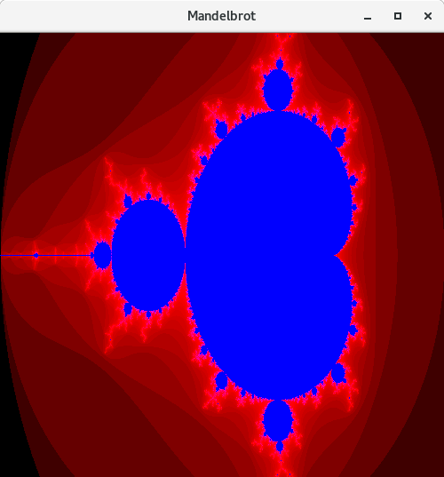
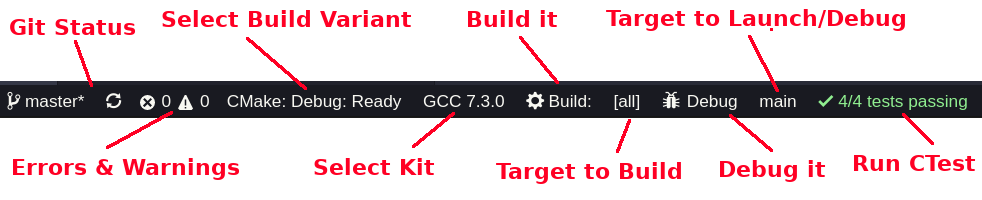
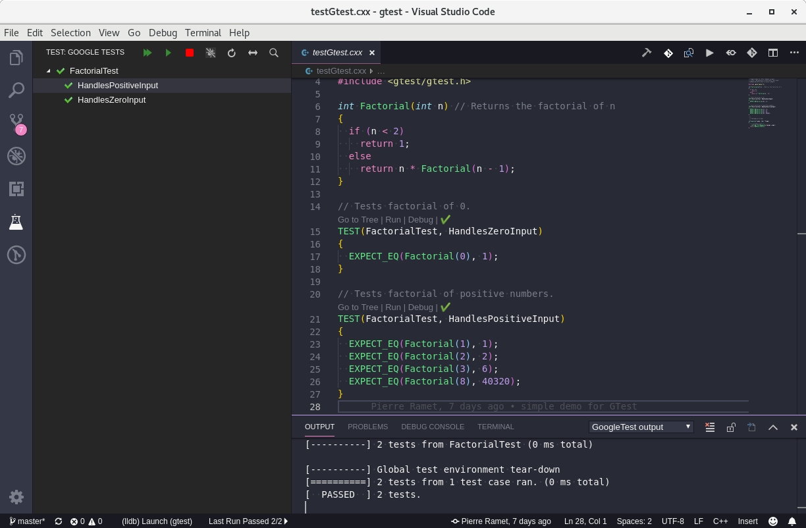
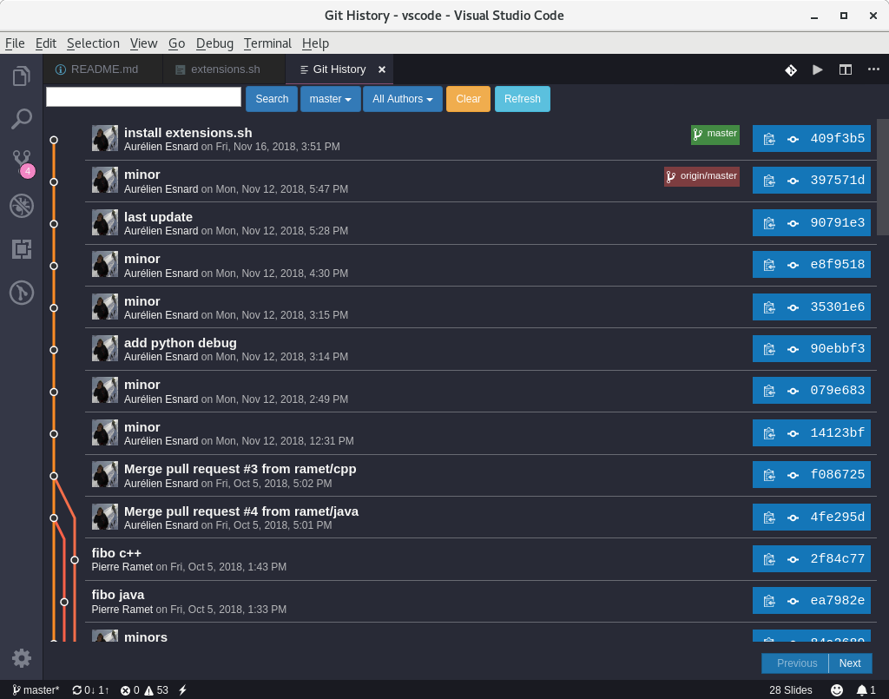
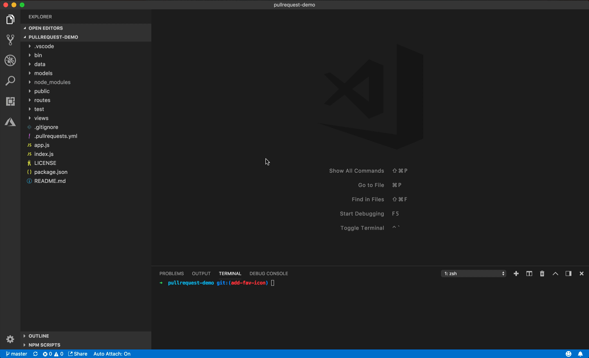
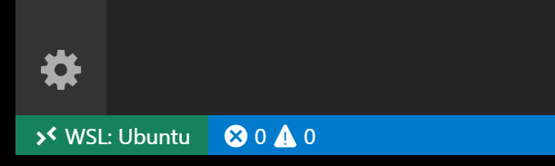

# Visual Studio Code (VSC)

<br>
<br>
<center><url>https://github.com/orel33/vscode</url></center>
<center> ~ </center>
<center><url>https://code.visualstudio.com</url></center>
<center> ~ </center>
<center>aurelien.esnard@u-bordeaux.fr</center>
<center>pierre.ramet@u-bordeaux.fr</center>
<br>
<br>

<center></center>

---

## Introduction

How to improve the *edit-compile-run* cycle?

→ Use a good IDE (Integrated Development Environment)...

What should be the *perfect* IDE?

* source code editor
* build automation tools (Makefile, CMake)
* runner, debugger (gdb, valgrind)
* code formatting (clang-format)
* syntax highlighting
* code navigation
* intelligent code completion, code snippet
* advanced search/replace, refactoring
* version control (SVN, GIT)
* linting, static code analysis (Clang)

*A poor workman blames his tools ;-)*

---

## Visual Studio Code (VSC)

Just another IDE & source code editor...

* Survey by [Stack Overflow](https://insights.stackoverflow.com/survey/2018/#development-environments-and-tools) : rank #13 en 2016, rank #1 en 2018 (75 000 users)
* Provided by Microsoft under free & open-source license (MIT)
* Cross-Platform: Linux, Windows, MacOS
* Hundred of languages supported : [overview](https://code.visualstudio.com/docs/languages/overview)
* First release in 2015 and [latest release](https://code.visualstudio.com/updates)
  * Vi & Emacs in 1976, Vim in 1991, Atom in 2014
* Written in TypeScript & JavaScript and based on [Electron](https://github.com/electron/electron) framework
  * the *Atom* shell provided by GitHub (backend Node.js + frontend Chromium)
* Extensible: many extensions available on <https://marketplace.visualstudio.com>
* Rich editor features: smart completion ([IntelliSense](https://code.visualstudio.com/docs/editor/intellisense)), linting, ...

Online-IDE: [Visual Studio Online](https://visualstudio.microsoft.com/fr/services/visual-studio-online/)
* <https://vscode.dev/>
* <https://github.dev/>

---

## Editor Overview

* Editors, Side Bar / Explorer (Ctrl+B), Actvity Bar, Status Bar, Panels (Ctrl+J)

<center></center>

See: <https://code.visualstudio.com/docs/getstarted/userinterface>

---

## Editor Overview

* File Palette (quick open file, Ctrl+P)

<center></center>

<small>select a file, then Enter to open it (or Ctrl+Enter to open it to the side)</small>

---

## Editor Overview

* Command Palette (access all commands, Ctrl+Shift+P)

<center></center>

<small> type ?: to see all possible actions (> command, : go to line, ...)</small>

---

## Keyboard Shortcuts

|     | Shortcut        | Description                        |
| --- | --------------- | ---------------------------------- |
| D   | Ctrl+C / X / V  | copy / cut / paste                 |
| D   | Ctrl+Z / Y      | undo / redo                        |
| D   | Ctrl+Shift+↑/↓  | undo / redo                        |
| D   | Ctrl+P          | quick open file palette            |
| D   | Ctrl+Shift+P    | quick open command palette         |
| D   | Ctrl+K Ctrl+T   | change theme                       |
| D   | Ctrl+K Z        | zen mode (Esc Esc to escape)       |
| D   | Ctrl+J / Ctrl+B | toggle panel / side bar visibility |
| D   | Ctrl+,          | edit user & workspace settings     |
| D   | Ctrl+W          | close current editor               |
| D   | Ctrl+N          | new file                           |
| D   | Ctrl+O          | open file                          |
| D   | Ctrl+S          | save / save as file                |
| U   | Ctrl+!          | split editor to right              |

<small>D: default shortcut on Linux; U: my user-defined shortcut.</small>

<small>See all keyboard shortcuts (setting button at bottom of activity bar) and add your own shortcuts...</small>

---

## Keyboard Shortcuts

|     | Shortcut        | Description                             |
| --- | --------------- | --------------------------------------- |
| D   | Ctrl+/          | toggle line(s) comment                  |
| D   | Alt+↑/↓         | move line(s) up / down                  |
| D   | Alt+Z           | toggle line wrapping                    |
| D   | Alt+Q           | hard line wrapping (rewrap extension)   |
| D   | Ctrl+Shift+I    | code formatting                         |
| D   | Ctrl+K Ctrl+X   | Trim all trailing spaces in file        |
| D   | Ctrl+Space      | trigger suggestion for completion       |
| D   | F12 / Ctrl+F12  | go to function definition / declaration |
| D   | Ctrl+Shift+F10  | peek definition                         |
| D   | Ctrl+Shift+V    | Markdown preview                        |
| D   | Ctrl+⇟ / Ctrl+⇞ | move to next / previous editor          |
| D   | Ctrl+Shift+B    | run build task                          |
| U   | Ctrl+Shift+R    | run task...                             |
| D   | Ctrl+F          | find in file                            |
| D   | Ctrl+Shift+F    | find in all files                       |
| D   | Ctrl+T          | go to program symbol in workspace       |
| D   | F3 / Shift+F3   | next / previous match (find)            |

Note:
* Debug shortcuts:  start debugging (F5), add breakpoints (F9), next (F10), build (F7), ...
* Refcards [Linux](https://code.visualstudio.com/shortcuts/keyboard-shortcuts-linux.pdf), [refcard MacOS](https://code.visualstudio.com/shortcuts/keyboard-shortcuts-macos.pdf), [refcard Windows](https://code.visualstudio.com/shortcuts/keyboard-shortcuts-windows.pdf)

---

## Installation

* Install or update VSC on Debian Linux: [install.sh](install.sh)

```bash
URL="https://vscode-update.azurewebsites.net/latest/linux-deb-x64/stable"
sudo apt-get install gdebi
wget $URL -O /tmp/vscode.deb
sudo gdebi /tmp/vscode.deb
```

Run VSC in your *working directory* as follow:

```bash
code .
```

Install extensions using *Integrated Extension Manager* (side bar) or command line:

```bash
code --list-extensions
code --install-extension <extension name>
```

See my [extensions.sh](extensions.sh) script to install (almost) all my favorite extensions...

---

## Extensions

All extensions are available on [Market Place](https://marketplace.visualstudio.com)... or directly from the *Integrated Extension Manager* (on side bar)

<center></center>

My recommandation:
* install extension *provided* by Microsoft or *recommanded* by VSC
* install *very popular* extensions (> 1M downloads)

---

## My Favorite Extensions

* [C/C++](https://marketplace.visualstudio.com/items?itemName=ms-vscode.cpptools), [Python](https://marketplace.visualstudio.com/items?itemName=ms-python.python), [Jupyter](https://marketplace.visualstudio.com/items?itemName=ms-toolsai.jupyter)
* [CMake](https://marketplace.visualstudio.com/items?itemName=twxs.cmake) + [CMake Tools](https://marketplace.visualstudio.com/items?itemName=ms-vscode.cmake-tools) + [Makefile Tools](https://marketplace.visualstudio.com/items?itemName=ms-vscode.makefile-tools)
* [GoogleTest Adapter](https://marketplace.visualstudio.com/items?itemName=DavidSchuldenfrei.gtest-adapter)
* [Doxygen Documentation Generator](https://marketplace.visualstudio.com/items?itemName=cschlosser.doxdocgen)
* [GitLens](https://marketplace.visualstudio.com/items?itemName=eamodio.gitlens) + [Git Graph](https://marketplace.visualstudio.com/items?itemName=mhutchie.git-graph) + [Git History](https://marketplace.visualstudio.com/items?itemName=donjayamanne.githistory) (view git log, file history, compare branches or commits)
* [Java](https://marketplace.visualstudio.com/items?itemName=vscjava.vscode-java-pack), [Fortran](https://marketplace.visualstudio.com/items?itemName=fortran-lang.linter-gfortran), [Rust](https://marketplace.visualstudio.com/items?itemName=rust-lang.rust-analyzer)
* [Code Runner](https://marketplace.visualstudio.com/items?itemName=formulahendry.code-runner) (run code snippet or code file for multiple languages)
* [Latex Workshop](https://marketplace.visualstudio.com/items?itemName=James-Yu.latex-workshop) (LaTeX support, compile, preview, autocomplete, ...)
* [Markdown All In One](https://marketplace.visualstudio.com/items?itemName=yzhang.markdown-all-in-one) (toc, preview, lists, ...) + [Markdown Lint](https://marketplace.visualstudio.com/items?itemName=DavidAnson.vscode-markdownlint) (linting)
* [Spell Right](https://marketplace.visualstudio.com/items?itemName=ban.spellright) (multilingual spellchecker)
* [Beautify](https://marketplace.visualstudio.com/items?itemName=HookyQR.beautify) (Beautify JavaScript, JSON, CSS, HTML, ...).
* [NPM](https://marketplace.visualstudio.com/items?itemName=eg2.vscode-npm-script) (JavaScript package manager) + [ESLint](https://marketplace.visualstudio.com/items?itemName=dbaeumer.vscode-eslint) (JavaScript linting, code formatting and more)
* [Bash Beautify](https://marketplace.visualstudio.com/items?itemName=shakram02.bash-beautify), [Path IntelliSense](https://marketplace.visualstudio.com/items?itemName=christian-kohler.path-intellisense), [Bracket Pair Colorizer](https://marketplace.visualstudio.com/items?itemName=CoenraadS.bracket-pair-colorizer), [Trailing Spaces](https://marketplace.visualstudio.com/items?itemName=shardulm94.trailing-spaces), [Todo Highlight](https://marketplace.visualstudio.com/items?itemName=wayou.vscode-todo-highlight), [VSC icons](https://marketplace.visualstudio.com/items?itemName=vscode-icons-team.vscode-icons) ...

---

## Additional Extensions

* [GitHub Copilot](https://marketplace.visualstudio.com/items?itemName=GitHub.copilot)
* [Binding Emacs](https://marketplace.visualstudio.com/items?itemName=hiro-sun.vscode-emacs), [Org-Mode](https://marketplace.visualstudio.com/items?itemName=vscode-org-mode.org-mode)
* [GitLab Workflow](https://marketplace.visualstudio.com/items?itemName=GitLab.gitlab-workflow), [GitHub Workflow](https://marketplace.visualstudio.com/items?itemName=GitHub.vscode-pull-request-github)
* [Mermaid](https://marketplace.visualstudio.com/items?itemName=bierner.markdown-mermaid)
* [Typst](https://marketplace.visualstudio.com/items?itemName=nvarner.typst-lsp) + [Typst Preview](https://marketplace.visualstudio.com/items?itemName=mgt19937.typst-preview)
* [Live Share](https://marketplace.visualstudio.com/items?itemName=MS-vsliveshare.vsliveshare) (collaborative editing)
* [Remote Development](https://marketplace.visualstudio.com/items?itemName=ms-vscode-remote.vscode-remote-extensionpack) (Remote SSH, WSL, Docker)

See my [extensions.txt](extensions.text) list obtained using :
```sh
code --list-extensions > extensions.txt
```

---

## Settings

All settings are stored in *json* file format (setting button at bottom of the activity bar or Ctrl+,)

* Three levels: workspace settings (*./.vscode/settings.json*) > user settings (*~/config/Code/User/settings.json*) > default settings
* Other *json* files for some specific settings (e.g. extensions)
* Custom tasks for build & run (settings in [tasks.json](https://go.microsoft.com/fwlink/?LinkId=733558))
* Debug configuration (settings in [launch.json](https://go.microsoft.com/fwlink/?linkid=830387))

---

## My User Settings

For instance, my user settings:

```json
{
    "editor.renderWhitespace": "all",
    "editor.minimap.enabled": true,
    "editor.renderIndentGuides": true,
    "git.confirmSync": false,
    "window.zoomLevel": 0,
    "gitlens.gitExplorer.files.layout": "tree",
    "editor.wordWrap": "on",
    "cmake.buildDirectory": "${workspaceRoot}/build",
    "editor.formatOnSave": true,
    "editor.formatOnType": true,
    "C_Cpp.clang_format_style": "file",
    "C_Cpp.clang_format_fallbackStyle": "Google",
    "C_Cpp.intelliSenseCacheSize": 0
}
```

---

## Demo

Some demos are available in this repository:

* [Code Runner](#code-runner) (directory `demo/hello/`)
* [C/C++ Programming](#cc-programming)
  - [Basic Example](#cc-programming) (directory `demo/fibonacci/`)
  - [Advanced Example](#cc-programming-advanced-example) (directory `demo/mandelbrot/`)
  - [CMake Project](#cmake-project) (directory `demo/cmake/`)
  - [Google Tests](#google-tests) (directory `demo/gtest/`)
* [Python Programming](#python-programming) (directory `demo/fibonacci/`)
* [JavaScript Programming](#javascript-programming) (directory `demo/fibonacci/`)
* [GIT Support](#git)
* [Writing in Markdown & LaTeX](#writing-in-markdown) (directory `demo/writing/`)

For each demo, launch VSC in the right directory:

```bash
cd demo/hello && code .
```

---

## Code Runner

* Quick run (Ctrl+Alt+N) using *Code Runner* extension...

<center></center>

<small>
C, C++, Java, JS, PHP, Python, Perl, Ruby, Go, Lua, Groovy, PowerShell, CMD, BASH, F#, C#, VBScript, TypeScript, CoffeeScript, Scala, Swift, Julia, Crystal, OCaml, R, AppleScript, Elixir, VB.NET, Clojure, Haxe, Objective-C, Rust, Racket, AutoHotkey, AutoIt, Kotlin, Dart, Pascal, Haskell, Nim, D, ...
</small>

---

## C/C++ Programming

Just install the Extension *C/C++* (provided by Microsoft)

* code navigation (F12), peek definition (Ctrl+Shift+F10), smart completion (Ctrl+Space), code formatting (Ctrl+Shift+I), linting and more...

Basic Example [demo/fibonacci/fib.c](demo/fibonacci/fib.c)

```c
/* fib.c */
#include <stdio.h>
#include <assert.h>
#include <stdlib.h>

int fib(int n)
{
    if (n <= 1) return 1;
    else return fib(n - 1) + fib(n - 2);
}

int main(int argc, char const *argv[])
{
    int n = 10;
    if (argc == 2) n = atoi(argv[1]);
    assert(n > 0);
    int sum = fib(n);
    printf("%d\n", sum);
    return 0;
}
```

Note:
* <https://code.visualstudio.com/docs/languages/cpp>

---

## C/C++ Programming: Building & Running

* In menu *Terminal > Configure Tasks...* and add a *build* task and a *run* task ([tasks.json](demo/fibonacci/.vscode/tasks.json))

```json
{
    "label": "build fib C",
    "type": "shell",
    "command": "gcc -Wall -std=c99 -g fib.c -o fib",
    "group": { "kind": "build", "isDefault": true },
    "problemMatcher": [ "$gcc" ]
},
{
    "label": "run fib C",
    "type": "shell",
    "command": "./fib",
    "dependsOn": [ "build fib.c" ],
}
```

* Use smart completion to learn about possible attributes (Ctrl+Space) and hover to view attribute descriptions...
* Then build, menu *Terminal > Run Build Task...* (or Ctrl+Shift+B)
* And run, menu *Terminal > Run Task...* (or Ctrl+Shift+R) and select the *run* task

Note:
* Set external console: ```"options": { "cwd": "${workspaceFolder}", "external": true }```

---

## C/C++ Programming: Advanced Example

Example [demo/mandelbrot](demo/mandelbrot/): a simple Makefile project using [SDL2](https://www.libsdl.org/index.php) graphics library as external dependency...

<center></center>

TODO: explain how to configure Intellisense (code navigation, linting, ...)

Note:
  * Advanced settings in file [.vscode/c_ccp_properties.json](demo/mandelbrot/.vscode/c_ccp_properties.json)

---

## C/C++ Programming: Code Formatting

* Code formatting based on *clang-format* external command (Ctrl+Shift+I)
* Available styles in VSC: "LLVM", "Google", "Chromium", "Mozilla", "WebKit" and  "Visual Studio" (default)
* Set the following user settings (Ctrl+,) and use your own file format (if it exists) or otherwise a fallback style

```json
    "C_Cpp.clang_format_style": "file",
    "C_Cpp.clang_format_fallbackStyle": "Google"
```

* Generate your own *clang* format file (*.clang-format*) based on a default style and tune it... Then share it in your workspace on top of your GIT repository... To start, apply the command it by hand on your whole projet.

```bash
clang-format -style=Google -dump-config > .clang-format
clang-format -i *.c *.h
```

Note:
* [Clang Style file format](https://clang.llvm.org/docs/ClangFormatStyleOptions.html)

---

## C/C++ Debugging

* In menu *Debug > Add Configration...* (or edit [launch.json](demo/fibonacci/.vscode/launch.json))
  * select environment C++ (GDB) to get a template configuration
  * edit the attributes: *name*, *program*, *args*, ...
  * use smart completion to learn about possible attributes (Ctrl+Space) and hover to view attribute descriptions...

```json
{
    "version": "0.2.0",
    "configurations": [
        {
            "name": "(gdb) Launch a.out",
            "type": "cppdbg",
            "request": "launch",
            "program": "${workspaceFolder}/a.out",
            "args": [ "20" ],
            "stopAtEntry": true,
            "cwd": "${workspaceFolder}",
            "environment": [],
            "externalConsole": false,
            "MIMode": "gdb",
            "setupCommands": [ ... ]
        }
    ]
}
```

 Note:
* For more information, visit: <https://go.microsoft.com/fwlink/?linkid=830387>

---

## C/C++ Debugging

<center></center>

<small>Shortcuts: start debugging (F5), start debugging (F5), add breakpoints (F9), next (F10), ... </small>

---

## CMake Project

* Extensions: *CMake* & *CMake Tools*
* Project files: ```main.c``` + library ```fib.c fib.h```
* Add a CMake project file: [CMakeLists.txt](demo/cmake/CMakeLists.txt)

```cmake
cmake_minimum_required(VERSION 2.6)
project(Fibonacci C)

### build ###

set(CMAKE_C_FLAGS "-std=c99 -Wall")
add_library(fib fib.c fib.h)
add_executable(main  main.c)
target_link_libraries(main fib)

### tests ###

include(CTest)
enable_testing()
set(args "1" "5" "10" "20")
set(sols "1" "8" "89" "10946")
foreach(i RANGE ${len})
  list(GET args ${i} arg)
  list(GET sols ${i} sol)
  add_test(fib-${arg} ./main ${arg})
  set_tests_properties(fib-${arg} PROPERTIES PASS_REGULAR_EXPRESSION "${sol}" TIMEOUT 3)
endforeach()
```

And just open VSC... Easy!

---

## CMake Project (Basics)

* Extensions: *CMake* & *CMake Tools*

* All CMake commands available from palette (Ctrl+Shift+P, type "cmake"...)
  * Build All (F7), Clean, Run CTest, ...
  * Build target (Shift+F7), Launch target (Shift+F5) or Quick Debug target (Ctrl+F5)
* In Status Bar, configure your project:
  * *Select Build Variant*: Debug, Release, MinSizeRel, ...
  * *Select Kit*: Clang, GCC, or unspecified (Let CMake guess your compiler...)
  * *Select Targets* : select both target to build (default *[all]*) and target to launch (or debug)
* Then just click in status bar on:
  * *CMake* to generate Makefiles
  * *Build* to compile project
  * *Debug* to debug the target to launch
  * *Tests* to re-run tests... (use Palette for the first time)

<center></center>

---

## CMake Debug

**Quick Debugging**: start it using the *CMake: Debug Target* command from the command palette (or Ctrl+F5). Change the *Debug Target* in the status bar, add a breakpoint and enjoy 😎

**Classic Debugging**: to get more flexibility (program arguments, working directory, ...), you need to define a debug configuration in the file ```.vscode/launch.json```... Just press F5, and select ```C++ (GDB/LLDB)``` and edit the default configuration file with the following options:

```json
{
    "version": "0.2.0",
    "configurations": [
        {
            "name": "(gdb) CMake Debug",
            "type": "cppdbg",
            "request": "launch",
            "program": "${workspaceFolder}/build/a.out", // <-- update this
            "args": [ "some", "args" ],                  // <-- update this
            "stopAtEntry": true,                         // <-- update this
            "cwd": "${workspaceFolder}",                 // <-- update this
            "environment": [],
            "externalConsole": false,
            "MIMode": "gdb",
            "setupCommands": [
                {
                    "description": "Enable pretty-printing for gdb",
                    "text": "-enable-pretty-printing",
                    "ignoreFailures": true
                }
            ]
        }
    ]
}
```

👉 Then, start debugging the program (F5) or start the program without debugging (Shift+F5)... See Debug menu.

To use the current CMake Debug/Launch Target (visible on status bar), you can change this key:

```json
"program": "${command:cmake.launchTargetPath}"
```

---

## CMake Project (Advanced)

* Set default CMake build directory in user settings:

```json
"cmake.buildDirectory": "${workspaceRoot}/build"
```

* Optionnaly, you can set some CMake options in your workspace settings:

 ```json
"cmake.configureSettings": {
  "CMAKE_C_FLAGS_DEBUG": "-g -fsanitize=address -fsanitize=leak -fsanitize=undefined",
  "CMAKE_VERBOSE_MAKEFILE": "ON"
}
```

---

## Google Tests

* GoogleTest C++ framework (not pure C): <https://github.com/abseil/googletest>
* Extension [GoogleTest Adapter](https://marketplace.visualstudio.com/items?itemName=DavidSchuldenfrei.gtest-adapter)
  * run all tests, run & debug each test (just in one click), ...
  * [demo](demo/gtest): launch the build task (Ctrl+Shift+B) and click the **Test** button in activity bar...

<center></center>

---

## Python Programming

Sample [demo/fibonacci/fib.py](demo/fibonacci/fib.py)

```python
import sys

def fib(n):
    if n <= 1:
        return 1
    else:
        return fib(n - 1) + fib(n - 2)

print(fib(10))
```

* *Python* extension (provided by Microsoft):
  * code navigation (F12), smart completion (Ctrl+Space), code formatting (Ctrl+Shift+I), linting, debugging (F5), refactoring (F2), ...

Note:
* [Fibonacci sequence](https://en.wikipedia.org/wiki/Fibonacci_number).

---

## Python Programming

* In menu *Terminal > Configure Tasks...* (or edit [.vscode/tasks.json](demo/fibonacci/.vscode/tasks.json))

```json
{
    "version": "2.0.0",
    "tasks": [
        {
            "label": "run fib.py",
            "type": "shell",
            "command": "python3 ",
            "args": [ "fib.py", "20" ]
        }
    ]
}
```

* Then run it: menu *Terminal > Run Task...*
* [Python Debugging](https://code.visualstudio.com/docs/python/debugging) : select your python file in editor, open Debug Mode (Ctrl+Shift+D) and select configuration "Python: Current File (integrated Terminal)", add breakpoint and run debug sesion...

Note:
* [syntax of tasks.json](https://go.microsoft.com/fwlink/?LinkId=733558)

---

## JavaScript Programming

Sample [demo/fibonacci/fib.js](demo/fibonacci/fib.js)

```js
var fib = function (n)
{
  if (n <= 1)
    return 1;
  else
    return fib(n - 1) + fib(n - 2);
};

 console.log(fib(10));
```

* Native support of JavaScript...
* Launch demo using *terminal* in panel: ```node fib.js``` or simply using *Code Runner* extension

```text
> Executing task: node fib.js <

89
```

---

## JavaScript Advanced Programming

Sample [demo/express/express.js](demo/express/express.js) for [Node.js](https://nodejs.org)

```js
const express = require('express')
const app = express()

app.get('/', function (req, res) {
  res.send('Hello World!')
})

app.listen(3000, function () {
  console.log('Example app listening on port 3000!')
})
```

* Install extensions for package manager (*NPM*) and linting (*ESLint*)
  * generate *package.json* for NPM and *.eslintrc.json* for ESLint

```bash
npm init
npm install express --save
eslint --init
```

Note:
* <http://expressjs.com/fr/starter/hello-world.html>
* More details on JavaScript programming: NPM, ESLint, ... <!-- reference -->

---

## GIT (1/2)

* Amazing built-in support, enhanced with *GitLens* & *Git History* extensions: blame, diff, branch, log, ...

<!-- <center></center> -->

<center></center>

Note:
* extension [GitLab Workflow](https://marketplace.visualstudio.com/items?itemName=GitLab.gitlab-workflow): demo CI with Inria GitLab

---

## GIT (2/2)

* Command Palette (Ctrl+Shift+P): *Git View History* or *Git View File History*... and performs advanced Git command (cherry-pick, revert, merge, rebase...)

<center></center>

Note: 2-ways vs [3-ways](https://code.visualstudio.com/docs/sourcecontrol/overview#_3way-merge-editor) merge editor

---

## GitHub Pull Requests

This [extension](https://marketplace.visualstudio.com/items?itemName=GitHub.vscode-pull-request-github) allows you to review and manage GitHub pull requests in Visual Studio Code.

* Authenticating and connecting VS Code to GitHub.
* Listing and browsing PRs from within VS Code.
* Reviewing PRs from within VS Code with in-editor commenting.
* Validating PRs from within VS Code with easy checkouts.

<center></center>

---

## Writing in MarkDown

* syntax highlighting, outline, preview on-the-fly (Ctrl+K V), ...
* formatting, list editing and more (extension *Markdown All in One*) + linting (extension *mardownlint*)
* show Markdown as slides (extension [vscode-reveal](https://marketplace.visualstudio.com/items?itemName=evilz.vscode-reveal))
* preview Mermaid diagrams (extension [Markdown Preview Mermaid Support](https://marketplace.visualstudio.com/items?itemName=bierner.markdown-mermaid))

<center></center>

Note:
* <https://ia.net/writer/support/general/markdown-guide>

---

## Writing in LaTeX

* highlighting, smart completion, building, view PDF, linting, ... (extension *LaTeX Workshop*)
* multilingual spell checker (extension *Spell Right*)

<center></center>

---

## Working with GCC on Windows using WSL2

Tutorial: https://code.visualstudio.com/docs/cpp/config-wsl

* Install VS Code on Windows
* Install extension [Remote WSL](https://marketplace.visualstudio.com/items?itemName=ms-vscode-remote.vscode-remote-extensionpack) in VS Code
* Install Linux inside Windows using WSL (Windows Subsystem for Linux)
  * https://docs.microsoft.com/fr-fr/windows/wsl/install-win10
  * Install WSL (version 2 recommanded) on Windows 10 (64 bits)
  * Install Ubuntu (or Debian) from Microsoft Store: https://aka.ms/wslstore
  * Install GCC on Ubuntu: `sudo apt-get update ; sudo apt-get install build-essential gdb`
* Launch VS Code on Windows and connect your Ubuntu using the *Remote WSL* extension... Green Button
* Another solution consists to launch directly the command `code .` from the WSL/Ubuntu...
  * It will automatically connect your *VS Code @ Windows*... (using VS Code server mechanism)
* From Windows, you can access the Linux file system at `\\wsl$`, and
  reciprocally you can access the Windows file system from Linux at `/mnt/c`

  <center></center>

---

## Remote Development

* Remote Docker
  * demo using image [tthor/test](https://hub.docker.com/repository/docker/tthor/test/).
  * Install VSCode server with remote extensions defined in `.devcontainer/devcontainer.json`

* Remote SSH
  * demo using [Plafrim](https://www.plafrim.fr/) access.
  * Install VSCode server with 'some' remote extensions

---

## About this Document

This document is written in *Markdown* and converted into slides by the extension *vscode-reveal* (based on [Reval.js](https://revealjs.com)).

This presentation and all demo are available on <https://github.com/orel33/vscode>:

```bash
git clone https://github.com/orel33/vscode.git
```

* ___Author(s)___ : Aurélien Esnard (aurelien.esnard@u-bordeaux.fr) and Pierre Ramet (pierre.ramet@u-bordeaux.fr)
