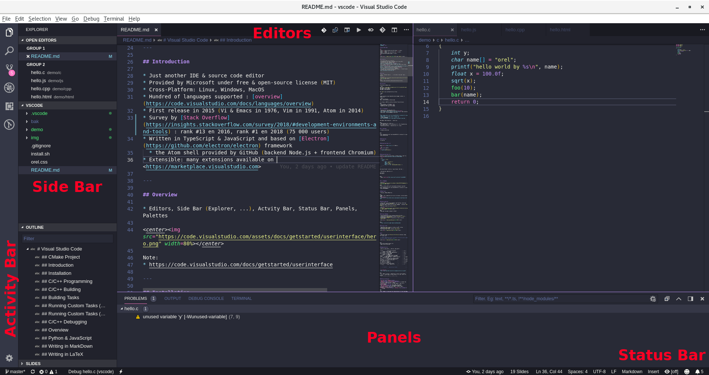
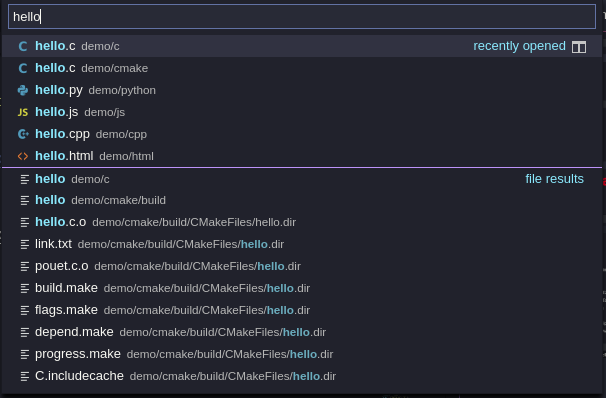
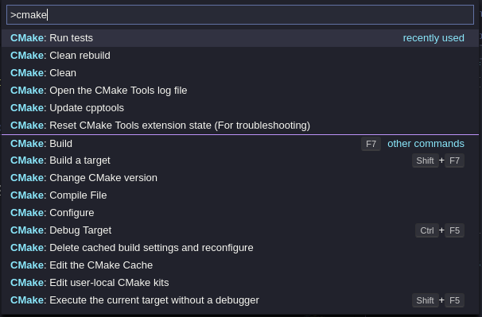
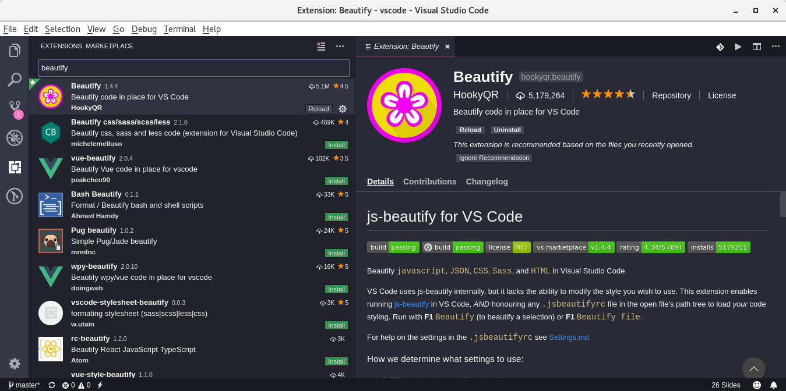
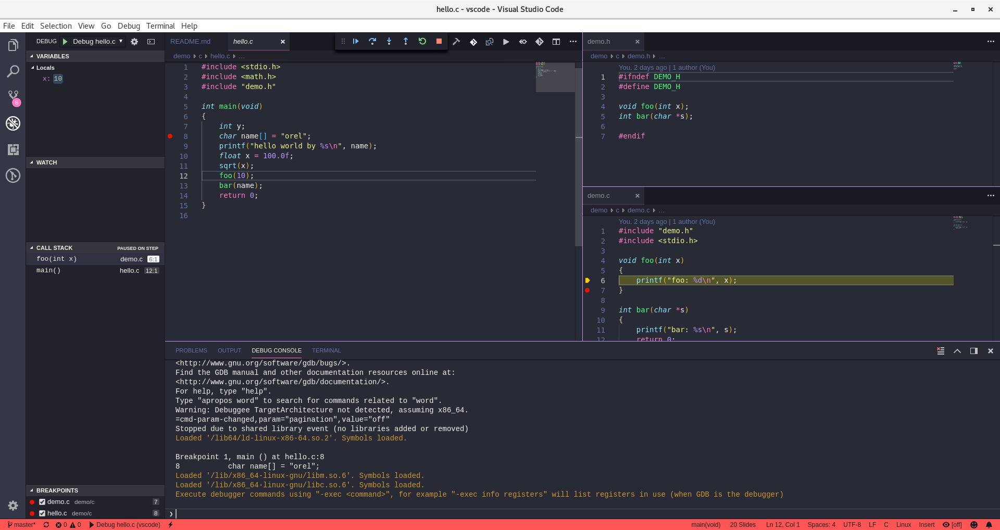
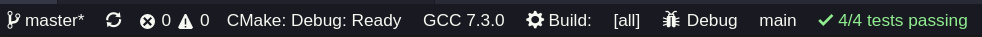
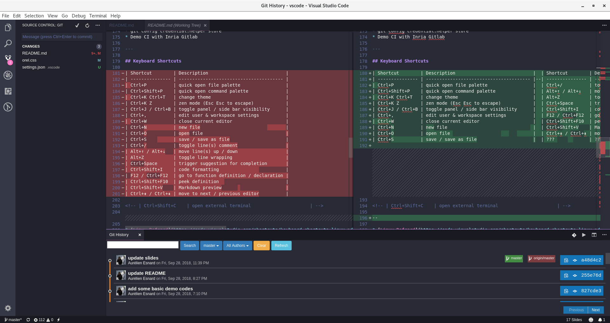
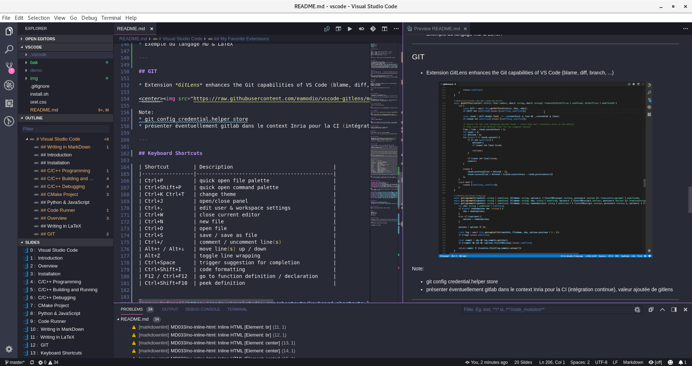
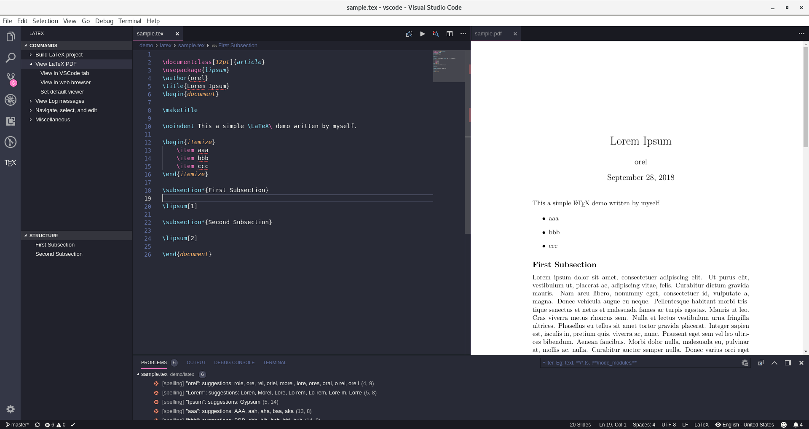

# Visual Studio Code

<br>
<br>
<center><url>https://github.com/orel33/vscode</url></center>
<center> ~ </center>
<center><url>https://code.visualstudio.com</url></center>
<center> ~ </center>
<center>aurelien.esnard@u-bordeaux.fr</center>
<br>
<br>

<center></center>

---

## Introduction

Just another IDE & source code editor...

* Provided by Microsoft under free & open-source license (MIT)
* Cross-Platform: Linux, Windows, MacOS
* Hundred of languages supported : [overview](https://code.visualstudio.com/docs/languages/overview)
* First release in 2015 (Vi & Emacs in 1976, Vim in 1991, Atom in 2014)
* Survey by [Stack Overflow](https://insights.stackoverflow.com/survey/2018/#development-environments-and-tools) : rank #13 en 2016, rank #1 en 2018 (75 000 users)
* Written in TypeScript & JavaScript and based on [Electron](https://github.com/electron/electron) framework
* the Atom shell provided by GitHub (backend Node.js + frontend Chromium)
* Extensible: many extensions available on <https://marketplace.visualstudio.com>
* Rich editor features: smart completion ([IntelliSense](https://code.visualstudio.com/docs/editor/intellisense)), linting, ...

Note:
* <https://electronjs.org/docs/tutorial/first-app>

---

## Editor Overview

* Editors, Side Bar (Explorer, ...), Actvity Bar, Status Bar, Panels

<center></center>

Note:
* <https://code.visualstudio.com/docs/getstarted/userinterface>

---

## Editor Overview

* File Palette (quick open file, Ctrl+P)

<center></center>

<small>select a file, then Enter to open it (or Ctrl+Enter to open it to the side)</small>

---

## Editor Overview

* Command Palette (access all commands, Ctrl+Shift+P)

<center></center>

<small> type ?: to see all possible actions (> command, : go to line, ...)</small>

---

## Editing Code

TODO: explain all shortcuts... how split the active editor in two, multi-selection (Ctrl+Shift+Arrows), ...

---

## Installation

Installation on Debian Linux:

```bash
URL="https://vscode-update.azurewebsites.net/1.27.2/linux-deb-x64/stable"
sudo apt-get install gdebi
wget $URL -O /tmp/vscode.deb
sudo gdebi /tmp/vscode.deb
```

Run VS Code in your *working directory* as follow:

```bash
code .
```

Install extensions using *Integrated Extension Manager* (side bar) or command line:

```bash
code --list-extensions
code --install-extension <extension name>
```

See my [install.sh](install.sh) script <!-- TODO: update it -->


---

## Extensions

All extensions are available on [Market Place](https://marketplace.visualstudio.com)... or directly from the *Integrated Extension Manager* (on side bar)

<center></center>

My recommandation:
* install extension *provided* by Microsoft or *recommanded* by VS Code
* install *very popular* extensions (> 1M downloads)

---

## My Favorite Extensions

* [C/C++](https://marketplace.visualstudio.com/items?itemName=ms-vscode.cpptools), [Python](https://marketplace.visualstudio.com/items?itemName=ms-python.python)
* [CMake](https://marketplace.visualstudio.com/items?itemName=twxs.cmake) + [CMake Tools](https://marketplace.visualstudio.com/items?itemName=vector-of-bool.cmake-tools)
* [GitLens](https://marketplace.visualstudio.com/items?itemName=eamodio.gitlens) + [Git History](https://marketplace.visualstudio.com/items?itemName=donjayamanne.githistory) (view git log, file history, compare branches or commits)
* [Doxygen Documentation Generator](https://marketplace.visualstudio.com/items?itemName=cschlosser.doxdocgen)
* [Code Runner](https://marketplace.visualstudio.com/items?itemName=formulahendry.code-runner) (run code snippet or code file for multiple languages)
* [Latex Workshop](https://marketplace.visualstudio.com/items?itemName=James-Yu.latex-workshop) (LaTeX support, compile, preview, autocomplete, ...)
* [Markdown All In One](https://marketplace.visualstudio.com/items?itemName=yzhang.markdown-all-in-one) (toc, preview, lists, ...) + [Markdown Lint](https://marketplace.visualstudio.com/items?itemName=DavidAnson.vscode-markdownlint) (linting)
* [Spell Right](https://marketplace.visualstudio.com/items?itemName=ban.spellright) (multilingual spellchecker)
* [Beautify](https://marketplace.visualstudio.com/items?itemName=HookyQR.beautify) (Beautify JavaScript, JSON, CSS, HTML, ...).
* [NPM](https://marketplace.visualstudio.com/items?itemName=eg2.vscode-npm-script) (JavaScript package manager) + [ESLint](https://marketplace.visualstudio.com/items?itemName=dbaeumer.vscode-eslint) (JavaScript linting, code formatting and more)

Some tips & tricks:

* [Path IntelliSense](https://marketplace.visualstudio.com/items?itemName=christian-kohler.path-intellisense) (filename auto-completion), [Bracket Pair Colorizer](https://marketplace.visualstudio.com/items?itemName=CoenraadS.bracket-pair-colorizer), [Trailing Spaces](https://marketplace.visualstudio.com/items?itemName=shardulm94.trailing-spaces), [Todo Highlight](https://marketplace.visualstudio.com/items?itemName=wayou.vscode-todo-highlight), ...


Note:
* [Extending VS Code](https://code.visualstudio.com/docs/extensions/overview) (extension written in TypeScript / JavaScript)
* [Settings Sync](https://github.com/shanalikhan/code-settings-sync)
* [GitLab Workflow](https://marketplace.visualstudio.com/items?itemName=fatihacet.gitlab-workflow)
* Other: VSCode Icons, Dracula Theme, VS Live Share, ...
* Useful? [CMake Tools Helper](https://marketplace.visualstudio.com/items?itemName=maddouri.cmake-tools-helper)


<!-- How about extensions for Docker, Node.js, Android? HTML / CSS format? -->
<!-- https://codeburst.io/top-javascript-vscode-extensions-for-faster-development-c687c39596f5 -->

---

## Settings

All settings in `.vscode/*.json` files (setting button at bottom of the activity bar or Ctrl+,)

* Three levels: default / user / workspace settings (settings.json) 

```json
{
    "editor.renderWhitespace": "all",
    "editor.minimap.enabled": true,
    "editor.renderIndentGuides": true,
    "editor.formatOnType": true,
    "git.confirmSync": false,
    "window.zoomLevel": 0,
    "gitlens.gitExplorer.files.layout": "tree",
    "revealjs.center": false,
    "explorer.confirmDragAndDrop": false,
    "editor.wordWrap": "on",
    "workbench.colorTheme": "Dracula",
    "explorer.confirmDelete": false,
    "cmake.buildDirectory": "${workspaceRoot}/build"
}
```

* Other files for some specific settings (e.g. extensions)
* Custom tasks for build & run (settings in [tasks.json](https://go.microsoft.com/fwlink/?LinkId=733558)) 
* Debug configuration (settings in [launch.json](https://go.microsoft.com/fwlink/?linkid=830387))

---

## Demo

All demo are available on <https://github.com/orel33/vscode>:

* [Code Runner](#code-runner) (directory `demo/hello/`)
* [JavaScript Programming](#javascript-programming) (directory `demo/fibonacci/`)
* [Python Programming](#python-programming-12) (directory `demo/fibonacci/`)
* [C/C++ Programming](#cc-programming-12) (directory `demo/fibonacci/`)
* [CMake Project](#cmake-project) (directory `demo/cmake`)
* [GIT Support](#git)
* [Writing in Markdown & LaTeX](#writing-in-markdown) (directory `demo/writing/`)

For each demo, launch VS Code in the right directory:

```bash
code demo/fibonacci/
```

---

## Code Runner

* Quick run (Ctrl+Alt+N) using *Code Runner* extension...

<center></center>

<small>
C, C++, Java, JS, PHP, Python, Perl, Ruby, Go, Lua, Groovy, PowerShell, CMD, BASH, F#, C#, VBScript, TypeScript, CoffeeScript, Scala, Swift, Julia, Crystal, OCaml, R, AppleScript, Elixir, VB.NET, Clojure, Haxe, Objective-C, Rust, Racket, AutoHotkey, AutoIt, Kotlin, Dart, Pascal, Haskell, Nim, D, ...
</small>

---

## JavaScript Programming

Sample [demo/fibonacci/fib.js](demo/fibonacci/fib.js)

```js
var fib = function (n)
{
  if (n <= 1)
    return 1;
  else
    return fib(n - 1) + fib(n - 2);
};

 console.log(fib(10));
```

* Native support of JavaScript...
* Launch demo using *terminal* in panel: ```node fib.js``` or simply using *Code Runner* extension

```text
> Executing task: node fib.js <

89
```

<!-- 

* Configure a running task (menu Terminal > Configure Tasks) or edit file tasks.json

```json
{
    "version": "2.0.0",
    "tasks": [
        {
            "label": "run fib.js",
            "type": "shell",
            "command": "node",
            "args": ["fib.js"]
        }
    ]
}
```

-->

---

## JavaScript Advanced Programming

Sample [demo/express/express.js](demo/express/express.js) for [Node.js](https://nodejs.org)

```js
const express = require('express')
const app = express()

app.get('/', function (req, res) {
  res.send('Hello World!')
})

app.listen(3000, function () {
  console.log('Example app listening on port 3000!')
})
```

* Install extensions for package manager (*NPM*) and linting (*ESLint*)
  * generate *package.json* for NPM and *.eslintrc.json* for ESLint

```bash
npm init
npm install express --save
eslint --init
```

Note:
* <http://expressjs.com/fr/starter/hello-world.html>
* More details on JavaScript programming: NPM, ESLint, ... <!-- reference -->

---

## Python Programming (1/2)

Sample [demo/fibonacci/fib.py](demo/fibonacci/fib.py)

```python
import sys

def fib(n):
    if n <= 1:
        return 1
    else:
        return fib(n - 1) + fib(n - 2)

print(fib(10))
```

* *Python* extension (provided by Microsoft):
  * code navigation (F12), smart completion (Ctrl+Space), code formatting (Ctrl+Shift+I), linting, debugging (F5), refactoring (F2), ...

Note:
* [Fibonacci sequence](https://en.wikipedia.org/wiki/Fibonacci_number).

---

## Python Programming (2/2)

* In menu *Terminal > Configure Tasks...* (or edit [.vscode/tasks.json](demo/fibonacci/.vscode/tasks.json))

```json
{
    "version": "2.0.0",
    "tasks": [
        {
            "label": "run fib.py",
            "type": "shell",
            "command": "python3 ",
            "args": [ "fib.py", "20" ]
        }
    ]
}
```

* Then run it: menu *Terminal > Run Task...*
* Easy debugging (menu Debug): start debugging (F5), add breakpoints (F9), next (F10), ...

Note:
* [syntax of tasks.json](https://go.microsoft.com/fwlink/?LinkId=733558)


---

## C/C++ Programming (1/2)

Sample [demo/fibonacci/fib.c](demo/fibonacci/fib.c)

```c
/* fib.c */
#include <stdio.h>
#include <assert.h>
#include <stdlib.h>

int fib(int n)
{
    if (n <= 1) return 1;
    else return fib(n - 1) + fib(n - 2);
}

int main(int argc, char const *argv[])
{
    int n = 10;
    if (argc == 2) n = atoi(argv[1]);
    assert(n > 0);
    int sum = fib(n);
    printf("%d\n", sum);
    return 0;
}
```

* Extension *C/C++* (provided by Microsoft):
  * code navigation (F12), peek definition (Ctrl+Shift+F10), smart completion (Ctrl+Space), *clang* code formatting (Ctrl+Shift+I), linting, ...

Note:
* <https://code.visualstudio.com/docs/languages/cpp>
* <https://blogs.msdn.microsoft.com/vcblog/2016/03/31/cc-extension-for-visual-studio-code/>
* code formatting based on *clang-format* (add file `.clang-format` in workspace directory)

---

## C/C++ Programming (2/2)

* Building & Running: add two tasks in [tasks.json](demo/fibonacci/.vscode/tasks.json)

```json
{
    "label": "build fib.c",
    "type": "shell",
    "command": "gcc -Wall -std=c99 -g fib.c -o fib",
    "group": { "kind": "build", "isDefault": true },  // default build task
    "problemMatcher": [ "$gcc" ]                      // output in panel
},
{
    "label": "run fib.c",
    "type": "shell",
    "command": "./fib",
    "dependsOn": [ "build fib.c" ],
    "problemMatcher": [ ]
}
```

* Then run it...
  * menu *Terminal > Run Task...* or Ctrl+Shift+B to run default build task...
  * on demand, associate GCC as *problemMatcher* to scan output problem...

Note:
* <https://blogs.msdn.microsoft.com/vcblog/2016/03/31/cc-extension-for-visual-studio-code/#building>

---

## C/C++ Debugging (1/2)

* In menu *Debug > Add Configration...* (or edit [launch.json](demo/fibonacci/.vscode/launch.json))
  * select environment C++ (GDB) to get a template configuration
  * edit the attributes: *name*, *program*, *args*, ...

```json
{
    "version": "0.2.0",
    "configurations": [
        {
            "name": "(gdb) Launch fib.c",
            "type": "cppdbg",
            "request": "launch",
            "program": "${workspaceFolder}/fib",
            "args": [ "20" ],
            "stopAtEntry": true,
            "cwd": "${workspaceFolder}",
            "environment": [],
            "externalConsole": false,
            "MIMode": "gdb",
            "setupCommands": [ /* ... */ ]
        }
    ]
}
```

 Note:
* Use smart completion to learn about possible attributes.
* Hover to view descriptions of existing attributes.
* For more information, visit: <https://go.microsoft.com/fwlink/?linkid=830387>

---

## C/C++ Debugging (2/2)

<center></center>

<small>Shortcuts: start debugging (F5), start debugging (F5), add breakpoints (F9), next (F10), ... </small>

Note:
* <https://github.com/Microsoft/vscode-cpptools/blob/master/launch.md>
* <https://blogs.msdn.microsoft.com/vcblog/2016/03/31/cc-extension-for-visual-studio-code/#debugging>
* configure debugging: <https://github.com/Microsoft/vscode-cpptools/blob/master/launch.md>
* [launch.json syntax](https://go.microsoft.com/fwlink/?linkid=830387) 

---

## CMake Project

* Project files: ```main.c``` + library ```fib.c fib.h```
* Add a CMake project file: [CMakeLists.txt](demo/cmake/CMakeLists.txt)

```cmake
cmake_minimum_required(VERSION 2.6)
project(Fibonacci C)

### build ###

set(CMAKE_C_FLAGS "-std=c99 -Wall")
add_library(fib fib.c fib.h)
add_executable(main  main.c)
target_link_libraries(main fib)

### tests ###

include(CTest)
enable_testing()
set(args "1" "5" "10" "20")
set(sols "1" "8" "89" "10946")
foreach(i RANGE ${len})
  list(GET args ${i} arg)
  list(GET sols ${i} sol)
  add_test(fib-${arg} ./main ${arg})
  set_tests_properties(fib-${arg} PROPERTIES PASS_REGULAR_EXPRESSION "${sol}" TIMEOUT 3)
endforeach()
```

---

## CMake Project

* Extensions: *CMake* & *CMake Tools*
  * Default CMake build directory in settings: ```${workspaceRoot}/build```
* All CMake commands available from palette (Ctrl+Shift+P, type "cmake"...)
  * Build (F7), Build target (Shift+F7), Clean, Run tests, ...
* In Status Bar, configure your project:
  * *Build Variant*: Debug, Release, MinSizeRel, ...
  * *Kit*: Clang, GCC, or unspecified (Let CMake guess your compiler...)
  * *Active Target* : all, main (executable), fib (library), ExperimentalTest, ExperimentalMemCheck (valgrind), ...
  * *Target to Launch*: main
* Then click in status bar on:
  * *CMake* to generate Makefiles
  * *Build* to compile project
  * *Debug* to debug the target to launch
  * *Tests* to re-run tests... (use Palette for the first time)

<center></center>

Note:
* [Getting Started with CMake in VS Code](https://vector-of-bool.github.io/docs/vscode-cmake-tools/getting_started.html)
* TODO: explain more advanced CMake (select options, ...)

---

## GIT

* Amazing Git support with *GitLens* & *Git History* extensions: blame, diff, branch, log, ...

<!-- <center></center> -->

<center></center>

Note:
* extension [GitLab Workflow](https://marketplace.visualstudio.com/items?itemName=fatihacet.gitlab-workflow)
* demo CI with Inria GitLab

---

## Writing in MarkDown

* syntax highlighting, outline, preview on-the-fly (Ctrl+K V), ...
* formatting, list editing and more (extension *Markdown All in One*) + linting (extension *mardownlint*)
* show Markdown as slides (extension [vscode-reveal](https://marketplace.visualstudio.com/items?itemName=evilz.vscode-reveal))

<center></center>


Note:
* <https://ia.net/writer/support/general/markdown-guide>

---

## Writing in LaTeX

* highlighting, smart completion, building, view PDF, linting, ... (extension *LaTeX Workshop*)
* multilingual spell checker (extension *Spell Right*)

<center></center>

---

## Keyboard Shortcuts (1/2)

| Shortcut        | Description                        |
| --------------- | ---------------------------------- |
| Ctrl+P          | quick open file palette            |
| Ctrl+Shift+P    | quick open command palette         |
| Ctrl+K Ctrl+T   | change theme                       |
| Ctrl+K Z        | zen mode (Esc Esc to escape)       |
| Ctrl+J / Ctrl+B | toggle panel / side bar visibility |
| Ctrl+,          | edit user & workspace settings     |
| Ctrl+W          | close current editor               |
| Ctrl+N          | new file                           |
| Ctrl+O          | open file                          |
| Ctrl+S          | save / save as file                |

---

## Keyboard Shortcuts (2/2)

| Shortcut        | Description                             |
| --------------- | --------------------------------------- |
| Ctrl+/          | toggle line(s) comment                  |
| Alt+↑ / Alt+↓   | move line(s) up / down                  |
| Alt+Z           | toggle line wrapping                    |
| Ctrl+Space      | trigger suggestion for completion       |
| Ctrl+Shift+I    | code formatting                         |
| F12 / Ctrl+F12  | go to function definition / declaration |
| Ctrl+Shift+F10  | peek definition                         |
| Ctrl+Shift+V    | Markdown preview                        |
| Ctrl+⇟ / Ctrl+⇞ | move to next / previous editor          |

<!-- | Ctrl+Shift+C    | open external terminal                      | -->

Note:
* See all keyboard shortcuts (setting button at bottom of activity bar)
* Debug shortcuts:  start debugging / continue (F5), step over (F10), ...
* CMake build (F7)
* Find in file (Crtl+F), find in all files (Ctrl+Shift+F), next (F3), previous (Shift+F3)
* Edit: copy (Ctrl+C), cut (Ctrl+X), paste (Ctrl+V), ca ctrl + z / y
* [refcard](https://code.visualstudio.com/shortcuts/keyboard-shortcuts-linux.pdf)

---

## About this Document

This document is written in *Markdown* and converted into slides by the extension *vscode-reveal* (based on [Reval.js](https://revealjs.com)).

This presentation and all demo are available on <https://github.com/orel33/vscode>:

```bash
git clone https://github.com/orel33/vscode.git
```

* ___Author___ : Aurélien Esnard (aurelien.esnard@u-bordeaux.fr)
* ___Acknowledgment___: Pierre Ramet
